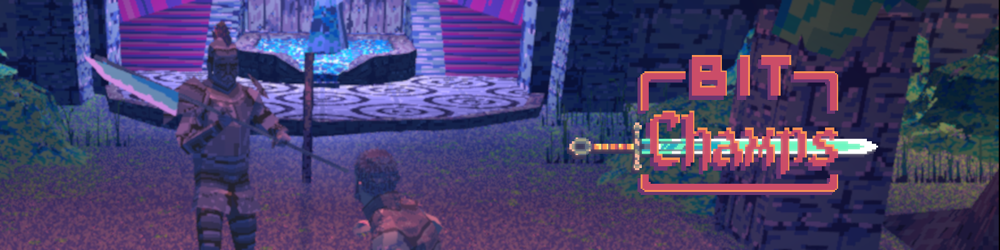
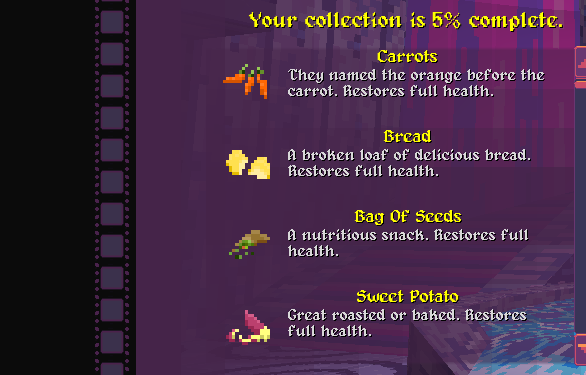
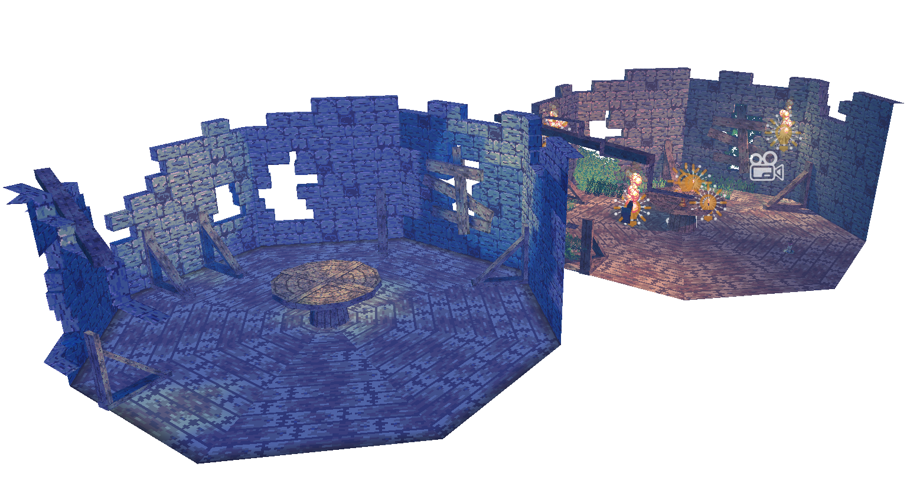
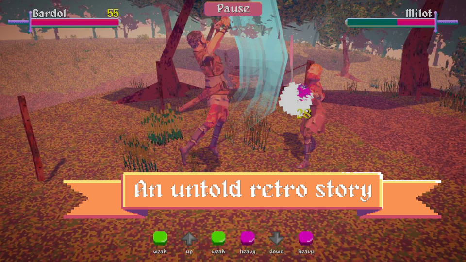
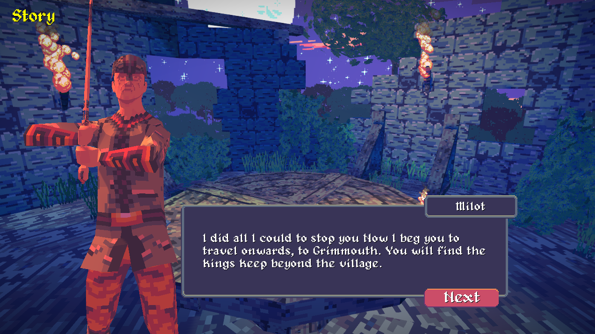
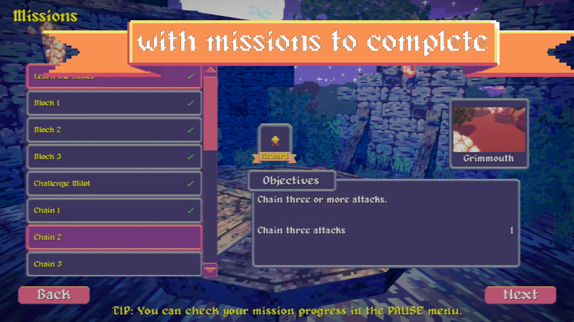
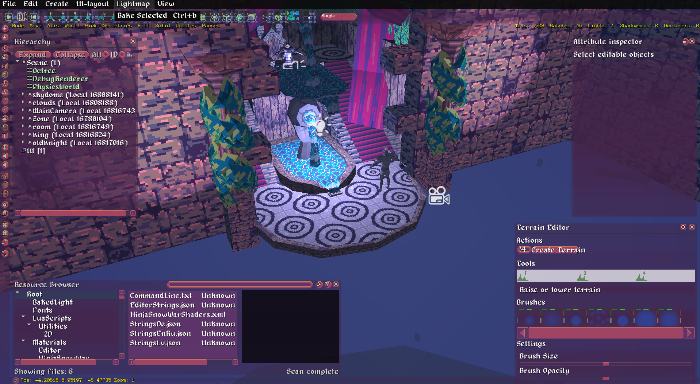

# bitchamps

## Summary

Bitchamps is a fantasy fighting game slightly inspired in old arcade games.
It features six selectable classes, three game modes and a collection system which unlocks many features, including characters, skins.

 
_The collection list_

## Technical

This game has a modified version of [Urho3D](https://urho3d.github.io/) that adds baked lighting based on the work of Urho3D community and [Lumak](https://github.com/Lumak/Urho3D-Lightmap) but totally different for our needs.

_Lightmap first implementation_

## Showcase

_Story mode main screen_

_Story mode example dialogue_

_Training mode when the fight starts_

_Urho3D's scene editor_

