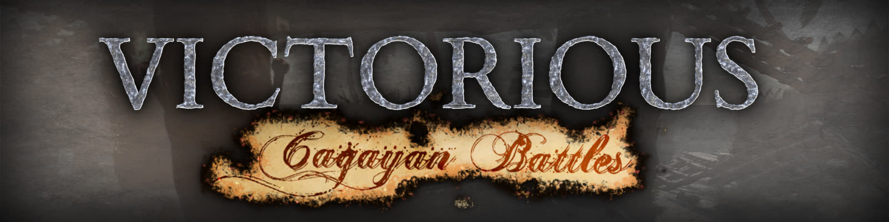
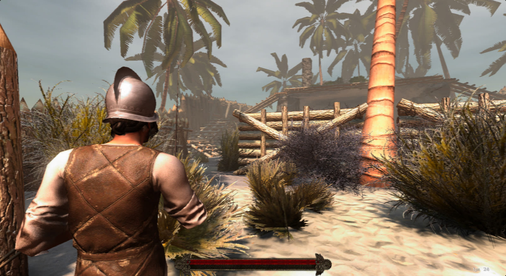
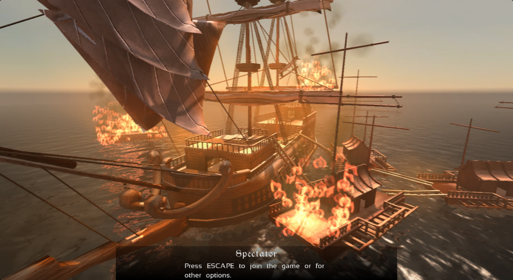

# Victorious - Cagayan Battles

## Summary

Victorious Cagayan Battles is a team based fps inspired by the 1582 Cagayan battles which were a series of clashes between the Spanish Empire colonizers of the Philippines and Wokou (possibly Japanese pirates). These battles took place in the vicinity of the Cagayan River.

This game features two teams with two classes, some maps and some basics but fun melee mechanics.

## Technical

This game has a modified version of [tesseract](http://tesseract.gg/), codename *divide* (as opposite of the original names).

- PBR rendering
- Moveable entities
- Combat system to handle melee combat
- Capture

 The [sourcecode](https://github.com/sx7889/victorious-cagayan-battles) was released on our last version.

## Showcase

